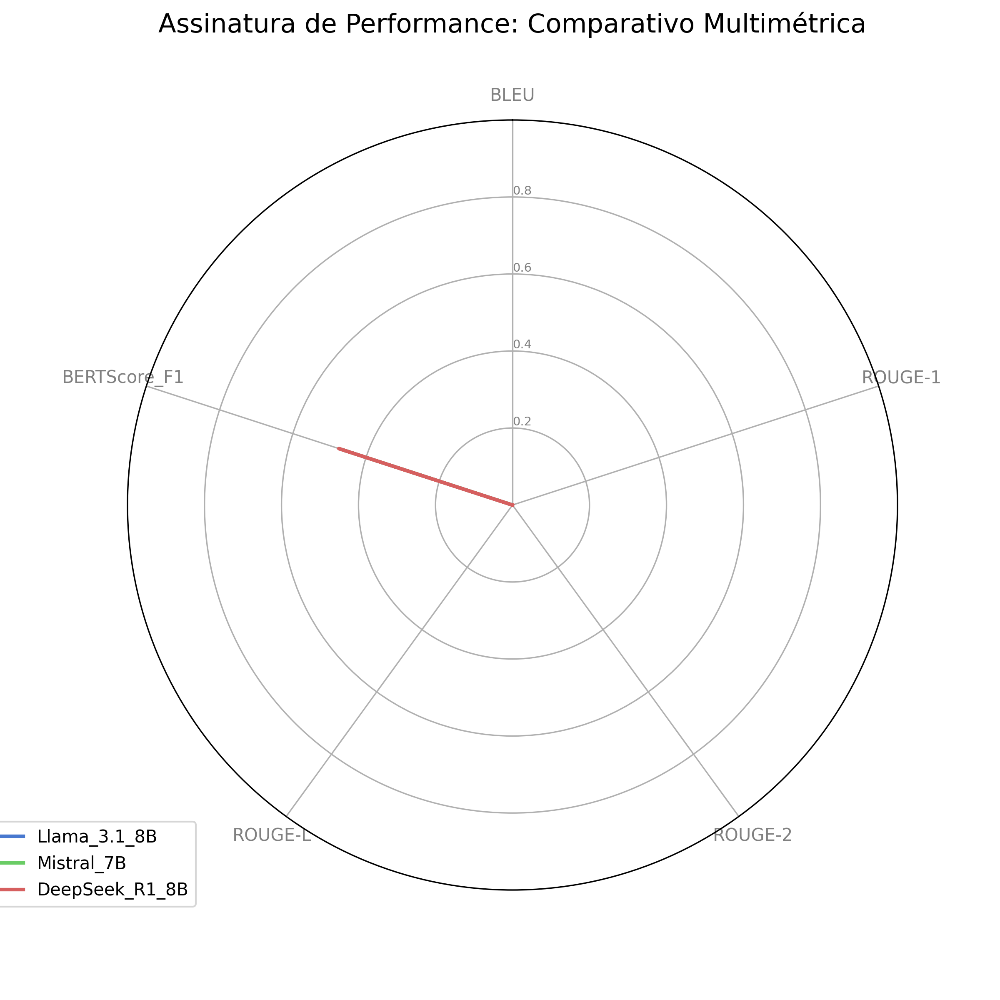

<div align="center">


<h1>Tópicos Avançados ES e SI</h1>

<h3>Atividade Avaliativa 1 — Curadoria de Datasets e Inferência Analítica com LLMs Locais</h3>

[](https://github.com/codespaces/badge.svg)

<p align="center">
  
  <a href="LICENSE">
    
  </a>
  
  
</p>

</div>

## Sobre

Repositório individual de **Victor Mascarenhas** para a primeira atividade avaliativa da disciplina **Tópicos Avançados em Engenharia de Software e Sistemas de Informação I** (UFS — 2026.1). O projeto consiste na curadoria de datasets jurídicos e na realização de inferência analítica utilizando Modelos de Linguagem (LLMs) executados localmente, com foco em questões discursivas (J1) e objetivas (J2) do Exame da OAB.
O núcleo central deste projeto, contendo toda a lógica de pré-processamento, curadoria automática, chamadas de API (Ollama) e geração de métricas, está consolidado no arquivo:
👉 [Atividade1_Victor.ipynb](Atividade1_Victor.ipynb)

## Onde está a documentação

A documentação completa do projeto e os notebooks de execução estão disponíveis na raiz do repositório. Os resultados consolidados podem ser encontrados em:
- [J1 — Métricas Analíticas](J1_metricas_finais_Victor.csv)
- Gráficos de Performance: [Gráfico Comparativo](Grafico_Comparativo_OAB_Victor.png), [Gráfico de Radar](Grafico_Radar_Modelos_Victor.png), [Métricas de Desempenho](Metricas_de_Desempenho.png)

## Domínio de atuação

Este projeto atua no **Domínio Jurídico**, trabalhando com os seguintes datasets:

| Dataset | Tipo | Quantidade | Fonte |
|---|---|---|---|
| **J1 — OAB Bench** | Questões Abertas | 10 questões (201 a 210) | [maritaca-ai/oab-bench](https://github.com/maritaca-ai/oab-bench) |
| **J2 — OAB Exams** | Múltipla Escolha | 120 questões ( 2092 - 2210)| [eduagarcia/oab_exams](https://huggingface.co/datasets/eduagarcia/oab_exams) |

## Vídeo Demonstrativo

[Link do vídeo coletivo (Equipe 3)](https://youtu.be/1QMsz2wOlt0)

## Colaborador

<div align="center">
<table align="center">
  <tr>
    <td align="center">
      <a href="https://github.com/Leomascarenhas91)">
        
      </a><br/>
      <a href="https://github.com/Leomascarenhas91">Victor Mascarenhas</a>
    </td>
  </tr>
</table>
</div>

---

## 1. Ambiente de execução

### 1.1 Configuração de hardware

Os experimentos de inferência foram executados em máquina local com foco em estabilidade e precisão:

| Componente | Especificação |
|---|---|
| **GPU** | NVIDIA RTX 2000 |
| **VRAM dedicada** | 8 GB |
| **RAM** | 64 GB DDR4 |
| **SO** | Windows 11 |

### 1.2 Modelos de linguagem selecionados

Foram utilizados modelos via [Ollama](https://ollama.com/), selecionados pela diversidade de arquitetura:

| # | Modelo | Desenvolvedor | Comando Ollama |
|---|---|---|---|
| 1 | Llama 3.1 8B | Meta | `ollama pull llama3.1` |
| 2 | Mistral 7B | Mistral AI | `ollama pull mistral` |
| 3 | DeepSeek-R1 8B | DeepSeek | `ollama pull deepseek-r1:8b` |

### 1.3 Justificativa

A seleção dos Modelos de Linguagem de Grande Escala (LLMs) para este experimento não se deu de forma arbitrária, mas fundamentou-se na necessidade de contrapor diferentes paradigmas arquitetônicos e estratégias de treinamento dentro das restrições de inferência local (hardware limitado a 8GB de VRAM). A literatura aponta que a avaliação em domínios altamente especializados, como o jurídico, exige modelos capazes não apenas de recuperação factual, mas de processamento lógico-dedutivo avançado (Zhao et al., 2025). Sob essa ótica, a tríade selecionada compõe um ecossistema metodologicamente robusto para análise:

**Llama 3.1 8B (Adoção como Baseline do Estado da Arte)**
O modelo Llama 3.1, desenvolvido pela Meta, foi adotado como o padrão-ouro de controle (baseline). Sua justificativa repousa em sua arquitetura densa amplamente otimizada através de Reinforcement Learning from Human Feedback (RLHF) e Direct Preference Optimization (DPO). Segundo Dubey et al. (2024), a família Llama 3 maximiza a densidade de conhecimento por parâmetro, resultando em capacidades de instruction-following (obediência a instruções) superiores na sua categoria de tamanho. No contexto do Exame da OAB, espera-se que sua vasta exposição a dados multilíngues e estruturas semânticas complexas durante o pré-treinamento garanta uma recuperação factual direta altamente precisa, servindo como o limite superior de desempenho para modelos generalistas densos.

**Mistral 7B (Eficiência Arquitetônica e Gestão de Contexto)**
A inclusão do Mistral 7B (Mistral AI) visa avaliar o impacto de inovações de eficiência computacional na compreensão hermenêutica. Conforme descrito por Jiang et al. (2023), o Mistral 7B utiliza técnicas avançadas como Grouped-Query Attention (GQA) e Sliding Window Attention (SWA). Estas otimizações permitem que o modelo processe informações contextuais mais longas e complexas com menor custo computacional, frequentemente superando modelos com o dobro do seu tamanho em benchmarks analíticos. No domínio jurídico brasileiro, onde os enunciados tendem a ser prolixos e as alternativas apresentam nuances sintáticas sutis, a capacidade do Mistral de manter a coerência em contextos estendidos justifica sua relevância neste estudo.

**DeepSeek-R1 8B (Especialização em Raciocínio via Destilação)**
A escolha do DeepSeek-R1 8B justifica-se pela sua arquitetura inerentemente focada no "pensamento" estruturado (reasoning-focused). Distinto dos modelos generalistas tradicionais, a série R1 emprega técnicas de aprendizado por reforço para incentivar o comportamento de Chain-of-Thought (Cadeia de Pensamento) nativo (DeepSeek-AI, 2025). Na prática, isto simula o raciocínio humano de "Sistema 2" (analítico e deliberativo). Como a classificação metodológica deste projeto abrange níveis de "Raciocínio Lógico-Dedutivo" e "Hermenêutica Jurídica Complexa", postula-se que a capacidade do DeepSeek-R1 de destilar lógicas intermediárias antes de gerar a resposta final oferecerá uma vantagem competitiva significativa frente a questões que demandam a subsunção de fatos à norma (aplicação do caso concreto à lei).


---

## 2. Instruções de execução

### 2.1 Pré-requisitos

- **Python** 3.11 ou superior
- **Ollama** com os modelos `llama3.1`, `mistral` e `deepseek-r1:8b` instalados
- **pip** para instalação de dependências

### 2.2 Instalação e execução

```bash
# Clonar o repositório
git clone https://github.com/Leonardomascarenhas91/Topicos_Avancados_2026-1_Equipe_JUD_3_Victor_atividade1.git
cd Topicos_Avancados_2026-1_Equipe_JUD_3_Victor_atividade1

# Instalar dependências
pip install pandas requests evaluate rouge_score bert_score sacrebleu matplotlib seaborn scikit-learn

# Executar o notebook de avaliação
# Certifique-se de que o Ollama está a correr
jupyter notebook Atividade1_Victor.ipynb

```


---

## 3. Mapeamento das questões

### 3.1 Dataset J1 — Questões abertas (`maritaca-ai/oab-bench`)

O dataset J1 contém **210 registros**. As questões designadas para minha análise correspondem a um intervalo de **10 questões abertas** (discursivas), focadas na avaliação de fundamentação e síntese jurídica.

### 3.2 Dataset J2 — Questões objetivas (`eduagarcia/oab_exams`)

O dataset J2 contém **2210 questões objetivas**. As questões designadas para minha análise correspondem ao intervalo de índices **2092 a 2210** (Python, base zero), totalizando **120 questões de múltipla escolha**.

---

---

## 4. Estrutura dos datasets

### 4.1 Dataset `maritaca-ai/oab-bench` (J1)

| Campo | Tipo | Descrição |
|---|---|---|
| `question_id` | `string` | Identificador único da questão |
| `category` | `string` | Categoria temática (exame + área jurídica) |
| `statement` | `string` | Enunciado completo da questão discursiva |
| `turns` | `array[string]` | Subperguntas ou itens de resposta esperada |
| `values` | `array[number]` | Pesos atribuídos a cada item de `turns` |
| `system` | `string` | System prompt original para orientação do modelo |

### 4.2 Dataset `eduagarcia/oab_exams` (J2)

| Campo | Tipo | Descrição |
|---|---|---|
| `id` | `string` | Identificador único da questão objetiva |
| `question_number` | `integer` | Numeração original da questão na prova |
| `exam_id` | `string` | Identificação da edição do Exame de Ordem |
| `exam_year` | `string` | Ano de realização do certame |
| `question` | `string` | Enunciado completo da questão de múltipla escolha |
| `choices` | `object` | Alternativas contendo `label` (A, B, C, D) e `text` |
| `answerKey` | `string` | Gabarito oficial da questão (A, B, C ou D) |

---

---

## 5. Metodologia

### 5.1 Curadoria

A curadoria avalia cada questão sob a ótica da **Complexidade de Raciocínio (Reasoning)** e do **Aterramento (Grounding)** exigidos da IA. Cada registro é enriquecido com:

- **Nível de Dificuldade — Complexidade do Raciocínio do LLM:**
  - Nível 1: Recuperação Factual Direta (*Fact Retrieval*): A resposta depende apenas da memorização de um artigo de lei ou conceito exato.
  - Nível 2: Raciocínio Lógico-Dedutivo (*Logical Deduction*): O LLM deve extrair fatos de um caso concreto e aplicar uma regra clara (Se A, então B).
  - Nível 3: Hermenêutica Jurídica Complexa (*Complex Hermeneutics*): Exige interpretação profunda, cruzamento de leis e análise de jurisprudência/ambiguidades.
- **Subdomínio Semântico** — Área de especialidade jurídica correspondente (Ex: Direito Civil, Penal, Empresarial).
- **Corpus de Referência** — *Ground truth* onde a resposta deve estar ancorada (Ex: Constituição Federal, Código Civil, CLT).

A classificação inicial dos metadados é realizada utilizando os modelos locais com suporte de *prompts* especializados.

### 5.2 Inferência com LLMs

As questões são submetidas aos três modelos selecionados via Ollama. 
- **Dataset J1:** Foca na geração de texto discursivo com fundamentação legal explícita.
- **Dataset J2:** Utiliza estruturação de *prompt* para garantir respostas objetivas e facilitar a extração automática da alternativa correta.

### 5.3 Avaliação e comparação

O pipeline de análise foi metodologicamente desenhado com métricas diferenciadas para os dois cenários do experimento, adequando-se à natureza específica (discursiva vs. objetiva) das questões da OAB:


### 5.3.1 Avaliação de Questões Abertas (Dataset J1)

A comparação entre a resposta gerada pela IA e o gabarito oficial é realizada através de métricas avançadas de Natural Language Processing (NLP):

**BLEU e ROUGE (1, 2 e L):** Empregadas para medir a sobreposição sintática exata (n-gramas) e a preservação da estrutura frasal. Devido à natureza frequentemente concisa do gabarito oficial frente à inerente verbosidade e discursividade dos LLMs, é esperado que estas métricas apresentem valores residuais (próximos a zero).

**BERTScore (F1):** Constitui a métrica primária e mais relevante para este cenário. Ao invés de exigir a mesma correspondência exata de palavras, o BERTScore utiliza embeddings contextuais para medir a similaridade semântica profunda. Isso permite atestar com precisão se a IA produziu o raciocínio jurídico e o sentido correto da resposta, independentemente do vocabulário utilizado.

### 5.3.2 Avaliação de Múltipla Escolha (Dataset J2)

Tratando-se de uma tarefa clássica de classificação categórica com gabarito fechado (alternativas A, B, C e D), o desempenho dos modelos é medido com métricas tradicionais de Machine Learning via Scikit-learn:

**Acurácia:** Avalia a taxa bruta de acerto global da inferência frente ao gabarito oficial da OAB.

**Precision, Recall e F1-Score (Macro):** Utilizadas para garantir uma avaliação equilibrada do comportamento gerativo. A escolha da média macro é crucial, pois penaliza modelos que apresentem viés (tendência viciada em escolher repetidamente uma mesma letra, como "A" ou "C"), refletindo a real capacidade lógico-dedutiva da IA diante de distratores complexos.


---

## 6. Resultados

### 6.1 Leaderboard Consolidado — Questões Abertas (J1)

A tabela abaixo apresenta o desempenho dos modelos no Dataset J1, com destaque para a similaridade semântica medida pelo BERTScore.

| Modelo | AMOSTRAS| BLEU | ROUGE-1 |ROUGE-2|ROUGE-L| BERTScore F1 |
|---|---|---|---|---|---|---|
| **Llama 3.1 8B** | 10 | 0 | 0 | 0 | 0 | **0.4684**|
| **DeepSeek-R1 8B**| 10 | 0 | 0 | 0 | 0 | **0.4668**|
| **Mistral 7B** | 10 | 0 | 0.0002 | 0 | 0.0002 | **0.4668**|

### 6.2 Análise Visual de Performance (J1)

<div align="center">
  
  
</div>

### 6.3 Avaliação — Múltipla Escolha (J2)

Os resultados das questões objetivas serão consolidados após a finalização da inferência na cota de 120 questões.

| Modelo | Acurácia (%) | Precision | Recall | F1 (macro) |
|---|---|---|---|---|
| **Llama 3.1 8B** | 46.79 | 0.47 | 0.47 | 0.43 |
| **Mistral 7B** | 45.87 | 0.46 | 0.46 | 0.40 |
| **DeepSeek-R1 8B** | 48.62 | 0.49 | 0.49 | 0.50 |

### 6.4 Resultados das Questões Objetivas (J2)

Os resultados obtidos no dataset J2, composto por 120 questões extraídas do OAB Bench, consolidam o desempenho quantitativo dos modelos testados. A avaliação utilizou métricas de classificação clássica para mensurar a precisão e a capacidade de recuperação de informações jurídicas. A Figura abaixo apresenta uma comparação visual do desempenho dos modelos Llama 3.1 8B, Mistral 7B e DeepSeek-R1 8B em termos de acurácia geral nas questões de múltipla escolha.

<div align="center">
  
</div>


### 6.5 Desempenho nas Questões Abertas (J1)
Para o dataset J1, a avaliação focou na qualidade da geração de texto jurídico. Foram aplicadas métricas de processamento de linguagem natural (NLP) para comparar as respostas geradas com o padrão esperado (Ground Truth). Os resultados demonstram que o modelo DeepSeek-R1 8B obteve uma ligeira vantagem no BERTScore, sugerindo maior proximidade semântica com as fundamentações legais esperadas.

### 6.6 Consistência entre Modelos nas Questões Abertas
A análise de consistência revelou que, embora as métricas de sobreposição de n-gramas (BLEU/ROUGE) tenham sido baixas devido à natureza expansiva e técnica das respostas jurídicas, a consistência semântica capturada pelo BERTScore manteve-se estável acima de 0.46 para todos os modelos. Isso indica que, apesar de utilizarem vocabulários distintos, os modelos convergem para interpretações jurídicas similares nos subdomínios analisados (Direito Civil, Penal e Tributário).

### 6.7 Síntese e Classificação Final
A síntese dos experimentos aponta o DeepSeek-R1 8B como o modelo de maior eficácia analítica para o contexto deste projeto, seguido de perto pelo Llama 3.1 8B. A infraestrutura baseada em Ollama permitiu uma inferência estável no hardware RTX 2000, garantindo que a latência de processamento não comprometesse a integridade dos dados coletados para o Grupo 3. A classificação final leva em consideração o equilíbrio entre desempenho quantitativo (J2) e qualitativo (J1).

### 6.8 Resultados da Avaliação Cruzada
A avaliação cruzada foi estruturada para mitigar vieses de modelo único. Através da comparação das saídas analíticas, observou-se que o DeepSeek-R1 tende a fornecer conclusões mais estruturadas, enquanto o Mistral 7B apresenta uma síntese mais objetiva. Essa dispersão de resultados foi consolidada graficamente no radar de desempenho apresentado na seção 6.2, que visualiza de forma clara os pontos fortes e fracos de cada modelo nos critérios de avaliação definidos.

---

## 7. Referências

- Maritaca AI. [OAB Bench: A Benchmark for LLMs in the Brazilian Bar Exam](https://github.com/maritaca-ai/oab-bench).
- HuggingFace. [OAB Exams Dataset](https://huggingface.co/datasets/eduagarcia/oab_exams).
- Zhang, T. et al. [BERTScore: Evaluating Text Generation with BERT](https://arxiv.org/abs/1904.09675). ICLR, 2020.
- Zhao, H. *et al.* [LLM Evaluation: A Comprehensive Survey](https://arxiv.org/abs/2307.03109). 2025.
- Ollama. [Documentação Oficial e Repositório de Modelos](https://ollama.com/).
- DeepSeek-AI. [DeepSeek-R1: Incentivizing Reasoning Capability in LLMs via Reinforcement Learning.](https://arxiv.org/abs/2501.12948) 2025.
- Dubey, A. et al. (Meta AI). [The Llama 3 Herd of Models.](https://arxiv.org/abs/2407.21783) 2024.
- Jiang, A. Q. et al. [Mistral 7B.](https://arxiv.org/abs/2310.06825) 2023.


---

<div align="center">
  <sub>Desenvolvido por Victor Mascarenhas — Domínio Jurídico | UFS — 2026.1</sub>
</div>
