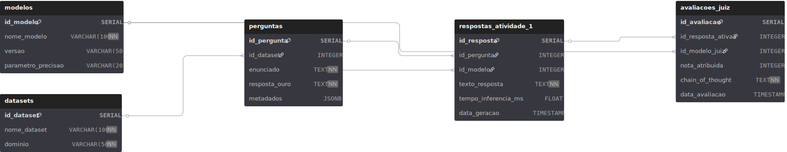
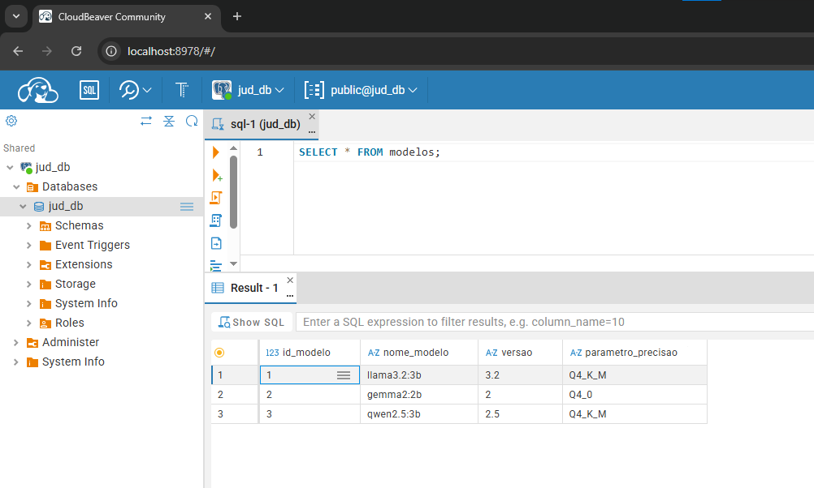
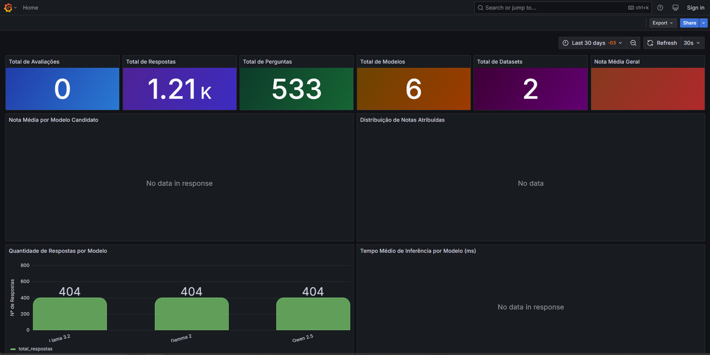

Português | [English](./README-EN.md)

<div align="center">


<h1>Tópicos Avançados ES e SI</h1>

<p>Atividade avaliativa 2: Implementação de framework "LLM-as-a-Judge" e persistência em banco de dados relacional</p>

<p align="center">
  <!-- Python version -->
  
  <!-- PostgreSQL -->
  
  <!-- License -->
  <a href="LICENSE">
    
  </a>
  <!-- Last commit -->
  <a href="https://github.com/Leomascarenhas91/Topicos_Avancados_2026_1_Equipe_JUD_3_atividade2/commits/main">
    
  </a>
  <!-- Stars -->
  <a href="https://github.com/Leomascarenhas91/Topicos_Avancados_2026_1_Equipe_JUD_3_atividade2/stargazers">
    
  </a>
</p>

</div>

<details>
<summary>Sumário (Clique para expandir)</summary>

- [Sobre](#sobre)
- [Apresentação](#apresentação)
- [Colaboradores](#colaboradores)
- [Arquitetura do banco de dados](#arquitetura-do-banco-de-dados)
- [Instruções de execução](#instruções-de-execução)
  - [Pré-requisitos](#pré-requisitos)
  - [Subindo o ambiente com Docker](#subindo-o-ambiente-com-docker)
  - [Acessando o CloudBeaver](#acessando-o-cloudbeaver)
  - [Executando consultas SQL no navegador](#executando-consultas-sql-no-navegador)
- [Pipeline LLM-as-a-Judge](#pipeline-llm-as-a-judge)
  - [Juízes suportados](#juízes-suportados)
  - [Configuração de credenciais](#configuração-de-credenciais)
  - [Executando o avaliador](#executando-o-avaliador)
- [Análise estatística (Spearman)](#análise-estatística-spearman)
- [Contribuições](#contribuições)
- [Licença](#licença)
- [Referências](#referências)

</details>

## Sobre

Este repositório contém as contribuições individuais do aluno **Victor Horta** para a segunda atividade avaliativa da disciplina **Tópicos Avançados em Engenharia de Software e Sistemas de Informação I** (UFS 2026.1).

O projeto dá continuidade à [Atividade 1](https://github.com/Leomascarenhas91/Topicos_Avancados_2026-1_Equipe_JUD_3_Victor_atividade1), avançando da inferência básica para uma avaliação estruturada das respostas dos modelos. As frentes principais são:

- **LLM-as-a-Judge:** implementação de um pipeline de julgamento automatizado com rubricas jurídicas (escala 1–5), extração de Chain-of-Thought e uso de modelos juízes para auditar acurácia técnica e fundamentação legal.
- **Persistência em PostgreSQL:** modelagem e implementação de um banco de dados relacional para armazenar o ciclo completo do experimento com datasets, respostas dos modelos candidatos e avaliações do juiz.
- **Análise estatística:** cálculo da correlação de Spearman entre as notas do Juiz-IA e o gabarito humano, com análise de erros e discussão dos resultados.

## Apresentação

> **Em breve.** O link do vídeo de apresentação (10–20 min) será adicionado aqui após a gravação.

O vídeo a seguir mostra os resultados coletados pela equipe para a segunda atividade avaliativa:

[](https://youtu.be/dQw4w9WgXcQ)

- **Assista ao vídeo completo:** [https://youtu.be/dQw4w9WgXcQ](https://youtu.be/dQw4w9WgXcQ)

## Colaboradores

<div align="center">
<table align="center">
  <tr>
    <td align="center">
      <a href="https://github.com/Leomascarenhas91">
        
      </a><br/>
      <a href="https://github.com/Leomascarenhas91">Victor Horta</a>
    </td>
  </tr>
</table>
</div>

---

## Arquitetura do banco de dados

O esquema relacional segue a estrutura sugerida pelo professor, com cinco tabelas principais:

- [Acesse o link para visualizar o diagrama detalhado no DBDiagram.io](https://dbdiagram.io/d/Topicos_Avancados_2026_1_Equipe_JUD_3_atividade2-69e940f2d80a958d1cb60703)



---

## Instruções de execução

### Pré-requisitos

| Requisito | Versão mínima | Descrição |
|-----------|---------------|-----------|
| [Python](https://www.python.org/downloads/) | 3.12+ | Linguagem principal do projeto |
| [Docker](https://docs.docker.com/get-docker/) | 24+ | Containerização dos serviços (PostgreSQL e CloudBeaver) |
| [Docker Compose](https://docs.docker.com/compose/install/) | 2.x | Orquestração dos contêineres |
| [Git](https://git-scm.com/install) | 2.x | Controle de versão |

> **Nota:** O PostgreSQL 17 já é provisionado automaticamente via Docker, não sendo necessário instalá-lo separadamente.

### Subindo o ambiente com Docker

Com o Docker instalado e em execução, basta rodar o comando abaixo na raiz do projeto:

```bash
docker compose up -d
```

Isso irá provisionar automaticamente dois serviços:

| Serviço           | Porta  | Descrição                                        |
|-------------------|--------|--------------------------------------------------|
| **PostgreSQL 17** | `5432` | Banco de dados relacional do projeto             |
| **CloudBeaver**   | `8978` | Interface web para gerenciar e consultar o banco |

Para verificar se os contêineres estão rodando corretamente:

```bash
docker compose ps
```

Para parar o ambiente:

```bash
docker compose down
```

### Instalação e execução

Para executar o projeto de forma local, siga os passos:

```bash
# (Opcional) Criar e ativar um ambiente virtual
python -m venv .venv

# Ativação no Linux/macOS
source .venv/bin/activate

# Ativação no Windows (PowerShell)
# .venv\Scripts\activate

# Instalar as dependências
uv sync
```

## Migrations

```bash
uv run python main.py db rollback
uv run python main.py db migrate
```

## Seeders

```bash
uv run python main.py db seed all
```

### Compartilhando extrações sem reprocessar

Os 6 extractors em `src/services/extractors/` baixam dados de curadoria e respostas dos repositórios GitHub de cada membro — é um processo lento (HTTP-bound + lookups por linha). Para evitar que todos os colegas refaçam isso, depois de rodar `seed perguntas` e `seed respostas`, exporte e faça commit:

```bash
uv run python main.py db seed export --type all
git add Atividade_2/exports/extracao-perguntas.json Atividade_2/exports/extracao-respostas.json
git commit -m "feat: extrações da Atividade 1 compiladas"
```

Os demais membros, após `git pull`:

```bash
uv run python main.py db seed import-all
```

O import resolve as referências por nome natural (dataset/categoria/modelo) em vez de IDs auto-incrementados, então funciona mesmo se o banco do colega tiver IDs diferentes. É idempotente em dois níveis: o `ExtracaoExporter` checa duplicatas antes de inserir, e o `PerguntaRepository.create` usa `ON CONFLICT DO NOTHING` como cinto de segurança no banco.

Comandos disponíveis:

| Comando | O que faz |
|---|---|
| `db seed export --type perguntas` | Exporta só perguntas. |
| `db seed export --type respostas` | Exporta só respostas. |
| `db seed export --type all` | Exporta os dois (default). |
| `db seed import <arquivo.json>` | Importa um arquivo (detecta o tipo automaticamente). |
| `db seed import-all` | Importa perguntas (primeiro) e respostas (depois) da pasta padrão, respeitando as FKs. |

### Acessando o CloudBeaver

O [CloudBeaver](https://dbeaver.com/docs/cloudbeaver/) é uma ferramenta web de administração de bancos de dados. Ela já vem configurada automaticamente com a conexão ao PostgreSQL do projeto.

1. Abra o navegador e acesse: [http://localhost:8978](http://localhost:8978)
2. O acesso anônimo já está habilitado, então **não é necessário fazer login**.
3. No painel lateral esquerdo, você verá a conexão **jud_db** já disponível.
4. Clique na conexão para expandir e visualizar as tabelas do banco.

> **Acesso administrativo:** Caso precise de permissões de administrador, utilize as credenciais `cbadmin` / `Admin123`.

### Executando consultas SQL no navegador

Para executar consultas SQL diretamente pelo CloudBeaver:

1. No painel lateral, clique na conexão **jud_db** para selecioná-la.
2. Clique no botão **SQL** na barra superior (ou pressione `Ctrl + Enter` após abrir o editor).
3. No editor SQL que será aberto, digite a sua consulta. Por exemplo:

```sql
SELECT * FROM modelos;
```

4. Clique no botão **▶ Executar** (ou pressione `Ctrl + Enter`) para rodar a consulta.
5. Os resultados serão exibidos na parte inferior do editor em formato de tabela.

Veja o exemplo da imagem abaixo:



---

### Acessando o Grafana

O [Grafana](https://grafana.com/docs/grafana/latest/) é uma ferramenta de visualização de dados. Ela já vem configurada automaticamente com a conexão ao PostgreSQL do projeto.

1. Abra o navegador e acesse: [http://localhost:3000](http://localhost:3000)
2. O acesso anônimo já está habilitado, então **não é necessário fazer login**.
3. No painel lateral esquerdo, você verá a conexão **jud_db** já disponível.
4. Clique na conexão para expandir e visualizar as tabelas do banco.

> **Acesso administrativo:** Caso precise de permissões de administrador, utilize as credenciais `admin` / `admin`.



---

## Pipeline LLM-as-a-Judge

O avaliador (Juiz-IA) lê as respostas geradas na Atividade 1 (tabela `respostas_atividade_1`), submete cada uma a um modelo juiz com a rubrica do Desembargador OAB (escala 1–5) e persiste o veredito (nota + Chain-of-Thought) em `avaliacoes_juiz`.

Arquitetura modular: `BaseJudge` (contrato) → `JudgeFactory` (resolve `provedor:modelo` na instância correta) → implementações concretas para [Ollama](src/services/judges/ollama_judge.py), [Anthropic](src/services/judges/anthropic_judge.py) e [OpenAI](src/services/judges/openai_judge.py). O prompt fica em [prompts.py](src/services/judges/prompts.py) e o parser do veredito em [parser.py](src/services/judges/parser.py). A idempotência é garantida no banco via constraint única em `(id_resposta_ativa1, id_modelo_juiz)`.

### Juízes suportados

| Spec CLI | Tipo | Modelo no banco |
|---|---|---|
| `ollama:llama3.1:8b` | Local (Ollama) | Llama 3.1 |
| `ollama:qwen2.5:7b` | Local (Ollama) | Qwen 2.5 |
| `anthropic:claude-sonnet-4-6` | API | Claude Sonnet 4.6 |
| `openai:gpt-4o` | API | GPT-4o |

Para listar dinamicamente:

```bash
uv run python main.py db judge list-available
```

### Configuração de credenciais

Copie `.env.example` para `.env` e preencha conforme o(s) juiz(es) que pretende usar:

```env
# Para juízes via API (opcionais — só preencha o que for usar)
ANTHROPIC_API_KEY=sk-ant-...
OPENAI_API_KEY=sk-...

# Para juízes locais via Ollama (default é http://localhost:11434)
OLLAMA_HOST=http://localhost:11434
```

Para juízes Ollama, garanta que o modelo já foi baixado:

```bash
ollama pull llama3.1:8b
ollama pull qwen2.5:7b
```

### Executando o avaliador

O comando aceita de 1 a 3 juízes por execução. Repita `-j` para usar múltiplos juízes:

```bash
# Apenas um juiz local (sem custo de API)
uv run python main.py db judge evaluate -j ollama:llama3.1:8b

# Smoke test com limite (útil para validar o pipeline)
uv run python main.py db judge evaluate -j ollama:llama3.1:8b --limit 5

# Multi-juiz (até 3)
uv run python main.py db judge evaluate \
  -j ollama:llama3.1:8b \
  -j anthropic:claude-sonnet-4-6 \
  -j openai:gpt-4o
```

O pipeline pula automaticamente respostas que o juiz informado já avaliou — pode interromper e retomar à vontade sem duplicar custo de API.

### Compartilhando avaliações sem reprocessar

Para evitar que cada membro da equipe pague a API novamente, depois de rodar `judge evaluate` faça o export e commit o arquivo:

```bash
uv run python main.py db judge export -j openai:gpt-4o-mini
git add Atividade_2/exports/avaliacoes-gpt-4o-mini.json
git commit -m "feat: avaliações do gpt-4o-mini"
```

Outros membros, após `git pull`, carregam os dados sem chamar API:

```bash
uv run python main.py db judge import Atividade_2/exports/avaliacoes-gpt-4o-mini.json
```

Comandos disponíveis:

| Comando | O que faz |
|---|---|
| `db judge export -j <spec>` | Exporta um juiz específico para `Atividade_2/exports/avaliacoes-<slug>.json`. |
| `db judge export --all` | Gera um arquivo por juiz que já tem avaliações no banco. |
| `db judge export -j <spec> --output <path>` | Exporta para um caminho customizado. |
| `db judge import <arquivo.json>` | Importa um arquivo específico (idempotente). |
| `db judge import-all` | Importa todos os `avaliacoes-*.json` da pasta padrão. |

O formato do arquivo é JSON portável com chaves naturais (nome do dataset, `id_externo` da pergunta, nome do modelo candidato) em vez de IDs auto-incrementados — então funciona mesmo se o banco do colega tiver IDs diferentes do seu. O import é idempotente em dois níveis: o `AvaliacoesExporter.import_file` checa se cada par `(resposta, juiz)` já existe, e a constraint `uq_avaliacoes_resposta_juiz` no banco é o cinto de segurança.

---

## Análise estatística (Spearman)

Após popular `avaliacoes_juiz`, o módulo de análise calcula a **correlação de Spearman (ρ)** entre o Juiz-IA e o gabarito humano. Esta seção explica o que é a métrica, por que escolhemos ela e como interpretar os resultados gerados pelo projeto.

### Por que Spearman e não Pearson?

As notas atribuídas pelo Juiz-IA (escala 1 a 5) são **dados ordinais**: existe uma ordem clara (5 é melhor que 4, que é melhor que 3...), mas a *distância* entre os valores não é necessariamente uniforme. A diferença qualitativa entre "Nota 1 — alucinação grave" e "Nota 2 — fundamentação vaga" pode ser muito maior do que a diferença entre "Nota 4 — excelente" e "Nota 5 — excepcional".

- A **correlação de Pearson** mede a relação *linear* entre variáveis contínuas e supõe que distâncias são significativas — premissa que **não vale** para nossa escala.
- A **correlação de Spearman** trabalha sobre *postos* (`ranks`): cada valor é transformado em sua posição relativa na amostra. Ela captura qualquer **relação monotônica** (crescente ou decrescente), independente de a função ser linear. Por isso é a métrica indicada quando os dados são ordinais, como notas em rubricas. É também a métrica explicitamente sugerida no enunciado da atividade.

### A fórmula

Quando não há empates entre as notas, Spearman tem a forma fechada clássica:

$$\rho = 1 - \frac{6 \sum_{i=1}^{n} d_i^2}{n(n^2 - 1)}$$

Onde:
- $d_i$ é a diferença entre o posto da nota do Juiz-IA e o posto da nota humana (gabarito), para a i-ésima pergunta;
- $n$ é o número total de questões avaliadas.

Quando há empates (frequente numa escala de 1–5), a implementação no `scipy.stats.spearmanr` calcula a correlação de Pearson sobre os postos médios — o resultado é equivalente e robusto. Por isso usamos o `scipy` em [spearman_service.py](src/services/analysis/spearman_service.py) em vez de implementar a fórmula manualmente.

A função também devolve um **p-value**, que indica a probabilidade de obter uma correlação tão forte quanto a observada *por puro acaso*. Valores baixos (tipicamente $p < 0.05$) indicam que a correlação é estatisticamente significativa.

### Metodologia aplicada no projeto

O comando `db analysis run` produz três blocos de saída:

```bash
uv run python main.py db analysis run
```

#### 1. Resumo agregado (estatística descritiva)

Para cada combinação `(dataset, modelo candidato, juiz)`, são calculadas média, desvio-padrão e contagem das notas. Serve como sanity check antes de olhar a correlação: se um juiz só dá nota 5, qualquer ρ será degenerado.

A query SQL por trás está em [avaliacao_repository.py](src/repositories/avaliacao_repository.py#L121-L156) e segue o exemplo do enunciado:

```sql
SELECT d.nome AS dataset, m_cand.nome_modelo AS candidato,
       m_juiz.nome_modelo AS juiz,
       AVG(a.nota_atribuida) AS media,
       STDDEV_SAMP(a.nota_atribuida) AS desvio,
       COUNT(a.id_avaliacao) AS total
FROM avaliacoes_juiz a
JOIN respostas_atividade_1 r ON r.id_resposta = a.id_resposta_ativa1
JOIN perguntas p ON p.id_pergunta = r.id_pergunta
JOIN datasets d ON d.id_dataset = p.id_dataset
JOIN modelos m_cand ON m_cand.id_modelo = r.id_modelo
JOIN modelos m_juiz ON m_juiz.id_modelo = a.id_modelo_juiz
GROUP BY d.nome, candidato, juiz;
```

#### 2. Cenário A — Juiz × Gabarito Humano (múltipla escolha)

Para questões de **múltipla escolha** (`oab_exams`), o gabarito humano é discreto (letra A, B, C, D ou E). Seguimos a estratégia descrita no enunciado:

1. Extrai-se o `answerKey` dos metadados da pergunta;
2. Verifica-se se o texto da resposta do modelo contém a letra correta (heurística com regex `\b<letra>\b`);
3. Converte-se o gabarito humano em uma **nota binarizada**: `5` se o modelo acertou, `1` se errou;
4. Calcula-se Spearman entre essa série binarizada e as notas do juiz para o mesmo conjunto de questões.

A intuição é direta: se o juiz dá nota alta sempre que o modelo acerta a alternativa correta e nota baixa quando erra, ρ se aproxima de 1.

#### 3. Cenário B — Inter-juízes (questões abertas)

Para questões **discursivas** (`oab_bench`) não há nota humana — o gabarito é um texto-guideline, não um número. Aqui usamos uma técnica complementar comum em LLM-as-a-Judge: **acordo inter-juízes** (`inter-rater agreement`).

Quando há ≥2 juízes que avaliaram as mesmas respostas, calculamos Spearman par a par. Isso responde duas perguntas importantes:

- **Convergência:** Se GPT-4o e Claude Sonnet 4.6 concordam (ρ alto), há indício de que a rubrica é robusta e o sinal não é aleatório.
- **Detecção de viés:** Se um juiz local barato (Llama 3.1 8B) tem ρ alto com um juiz "premium" (GPT-4o), ele pode ser um substituto viável; se tem ρ baixo, fica evidenciado o trade-off custo × qualidade.

### Interpretação de ρ

A faixa de Spearman é $\rho \in [-1, 1]$. A leitura recomendada pelo enunciado:

| Faixa de ρ | Leitura | Ação recomendada |
|---|---|---|
| 0.7 – 1.0 | **Forte alinhamento** | O juiz "pensa" como o gabarito; viável usá-lo em escala. |
| 0.3 – 0.6 | **Alinhamento moderado** | Rubrica precisa ser mais específica; revisar critérios. |
| 0.0 – 0.3 | **Alinhamento fraco** | Juiz inconsistente; trocar modelo ou refinar prompt. |
| < 0 | **Discordância sistemática** | Achado científico — investigar viés (juiz pode estar mais atualizado que o gabarito, ou vice-versa). Documentar no relatório. |

Casos especiais tratados em [spearman_service.py](src/services/analysis/spearman_service.py):

- **Amostra insuficiente** (n < 2): ρ é indefinido; o relatório imprime `motivo` em vez de quebrar.
- **Notas constantes** (juiz dá sempre a mesma nota): a variância é zero, ρ é indefinido; reportado explicitamente.
- **Gabarito ausente** (`answerKey` faltando nos metadados): a questão é pulada e contada em `skipped(sem gabarito)`.

### Limitação conhecida: gabarito em múltipla escolha

O bloco "Juiz × Gabarito Humano" depende de `answerKey` estar presente em `metadados.jsonb` das perguntas de múltipla escolha. O [base_extractor.py](src/services/extractors/base_extractor.py) foi atualizado para capturar esse campo, mas as inserções usam `ON CONFLICT DO NOTHING` — se o banco foi populado **antes** dessa atualização, as linhas antigas não receberão `answerKey`.

Para resolver:

```bash
uv run python main.py db rollback   # reverte migrations
uv run python main.py db migrate    # recria as tabelas
uv run python main.py db seed all   # recaptura tudo com o answerKey já presente
```

### Referência

- [SciPy: scipy.stats.spearmanr](https://docs.scipy.org/doc/scipy/reference/generated/scipy.stats.spearmanr.html) — implementação usada.
- Spearman, C. (1904). *The Proof and Measurement of Association between Two Things*. American Journal of Psychology.

---

## Contribuições

Consulte o arquivo [CONTRIBUTING.md](CONTRIBUTING.md).

## Licença

Este projeto utiliza a Licença MIT. Consulte o arquivo [LICENSE](LICENSE) para os termos completos.

## Referências

- [Atividade 1: Repositório da Equipe JUD_3](https://github.com/Leomascarenhas91/Topicos_Avancados_2026-1_Equipe_JUD_3_Victor_atividade1)
- [OAB Bench](https://huggingface.co/datasets/maritaca-ai/oab-bench)
- [OAB Exams](https://huggingface.co/datasets/eduagarcia/oab_exams)
- [PostgreSQL Documentation](https://www.postgresql.org/docs/)
- [LLM Evaluation: A Comprehensive Survey](https://arxiv.org/html/2504.21202v1)
- [SciPy: spearmanr](https://docs.scipy.org/doc/scipy/reference/generated/scipy.stats.spearmanr.html)

---

<div align="center">
  <sub>Desenvolvido pela Equipe 3 (Domínio Jurídico) | UFS 2026.1</sub>
</div>
