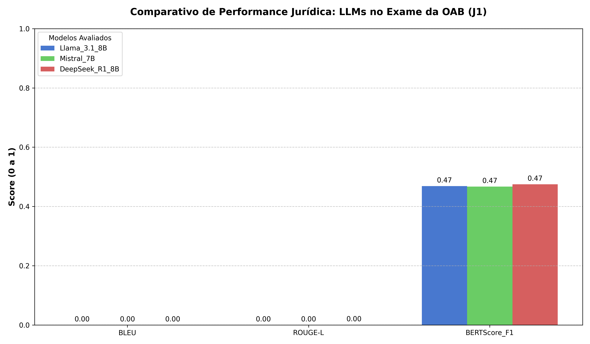

<div align="center">


<h1>Tópicos Avançados ES e SI</h1>

<h3>Atividade Avaliativa 1 — Curadoria de Datasets e Inferência Analítica com LLMs Locais</h3>

[](https://github.com/codespaces/badge.svg)

<p align="center">
  
  <a href="LICENSE">
    
  </a>
  
  
</p>

</div>

## Sobre

Repositório individual de **Victor Mascarenhas** para a primeira atividade avaliativa da disciplina **Tópicos Avançados em Engenharia de Software e Sistemas de Informação I** (UFS — 2026.1). O projeto consiste na curadoria de datasets jurídicos e na realização de inferência analítica utilizando Modelos de Linguagem (LLMs) executados localmente, com foco em questões discursivas (J1) e objetivas (J2) do Exame da OAB.
O núcleo central deste projeto, contendo toda a lógica de pré-processamento, curadoria automática, chamadas de API (Ollama) e geração de métricas, está consolidado no arquivo:
👉 [Atividade1_Victor.ipynb](Atividade1_Victor.ipynb)

## Onde está a documentação

A documentação completa do projeto e os notebooks de execução estão disponíveis na raiz do repositório. Os resultados consolidados podem ser encontrados em:
- [J1 — Métricas Analíticas](J1_metricas_finais_Victor.csv)
- [Gráficos de Performance](Grafico_Comparativo_OAB_Victor.png)(Grafico_Radar_Modelos_Victor.png)

## Domínio de atuação

Este projeto atua no **Domínio Jurídico**, trabalhando com os seguintes datasets:

| Dataset | Tipo | Quantidade | Fonte |
|---|---|---|---|
| **J1 — OAB Bench** | Questões Abertas | 10 questões (201 a 210) | [maritaca-ai/oab-bench](https://github.com/maritaca-ai/oab-bench) |
| **J2 — OAB Exams** | Múltipla Escolha | 120 questões ( 2092 - 2210)| [eduagarcia/oab_exams](https://huggingface.co/datasets/eduagarcia/oab_exams) |

## Vídeo Demonstrativo

> **Link do vídeo coletivo (Equipe 3):** [A ser adicionado](#)

## Colaborador

<div align="center">
<table align="center">
  <tr>
    <td align="center">
      <a href="https://github.com/Leomascarenhas91)">
        
      </a><br/>
      <a href="https://github.com/Leomascarenhas91">Victor Mascarenhas</a>
    </td>
  </tr>
</table>
</div>

---

## 1. Ambiente de execução

### 1.1 Configuração de hardware

Os experimentos de inferência foram executados em máquina local com foco em estabilidade e precisão:

| Componente | Especificação |
|---|---|
| **GPU** | NVIDIA RTX 2000 |
| **VRAM dedicada** | 8 GB |
| **RAM** | 64 GB DDR4 |
| **SO** | Windows 11 |

### 1.2 Modelos de linguagem selecionados

Foram utilizados modelos via [Ollama](https://ollama.com/), selecionados pela diversidade de arquitetura:

| # | Modelo | Desenvolvedor | Comando Ollama |
|---|---|---|---|
| 1 | Llama 3.1 8B | Meta | `ollama pull llama3.1` |
| 2 | Mistral 7B | Mistral AI | `ollama pull mistral` |
| 3 | DeepSeek-R1 8B | DeepSeek | `ollama pull deepseek-r1:8b` |


---

## 2. Instruções de execução

### 2.1 Pré-requisitos

- **Python** 3.11 ou superior
- **Ollama** com os modelos `llama3.1`, `mistral` e `deepseek-r1:8b` instalados
- **pip** para instalação de dependências

### 2.2 Instalação e execução

```bash
# Clonar o repositório
git clone https://github.com/Leonardomascarenhas91/Topicos_Avancados_2026-1_Equipe_JUD_3_Victor_atividade1.git
cd Topicos_Avancados_2026-1_Equipe_JUD_3_Victor_atividade1

# Instalar dependências
pip install pandas requests evaluate rouge_score bert_score sacrebleu matplotlib seaborn scikit-learn

# Executar o notebook de avaliação
# Certifique-se de que o Ollama está a correr
jupyter notebook Atividade1_Victor.ipynb

```


---

## 3. Mapeamento das questões

### 3.1 Dataset J1 — Questões abertas (`maritaca-ai/oab-bench`)

O dataset J1 contém **210 registros**. As questões designadas para minha análise correspondem a um intervalo de **10 questões abertas** (discursivas), focadas na avaliação de fundamentação e síntese jurídica.

### 3.2 Dataset J2 — Questões objetivas (`eduagarcia/oab_exams`)

O dataset J2 contém **2210 questões objetivas**. As questões designadas para minha análise correspondem ao intervalo de índices **2092 a 2210** (Python, base zero), totalizando **120 questões de múltipla escolha**.

---

---

## 4. Estrutura dos datasets

### 4.1 Dataset `maritaca-ai/oab-bench` (J1)

| Campo | Tipo | Descrição |
|---|---|---|
| `question_id` | `string` | Identificador único da questão |
| `category` | `string` | Categoria temática (exame + área jurídica) |
| `statement` | `string` | Enunciado completo da questão discursiva |
| `turns` | `array[string]` | Subperguntas ou itens de resposta esperada |
| `values` | `array[number]` | Pesos atribuídos a cada item de `turns` |
| `system` | `string` | System prompt original para orientação do modelo |

### 4.2 Dataset `eduagarcia/oab_exams` (J2)

| Campo | Tipo | Descrição |
|---|---|---|
| `id` | `string` | Identificador único da questão objetiva |
| `question_number` | `integer` | Numeração original da questão na prova |
| `exam_id` | `string` | Identificação da edição do Exame de Ordem |
| `exam_year` | `string` | Ano de realização do certame |
| `question` | `string` | Enunciado completo da questão de múltipla escolha |
| `choices` | `object` | Alternativas contendo `label` (A, B, C, D) e `text` |
| `answerKey` | `string` | Gabarito oficial da questão (A, B, C ou D) |

---

---

## 5. Metodologia

### 5.1 Curadoria

A curadoria avalia cada questão sob a ótica da **Complexidade de Raciocínio (Reasoning)** e do **Aterramento (Grounding)** exigidos da IA. Cada registro é enriquecido com:

- **Nível de Dificuldade — Complexidade do Raciocínio do LLM:**
  - Nível 1: Recuperação Factual Direta (*Fact Retrieval*)
  - Nível 2: Raciocínio Lógico-Dedutivo (*Logical Deduction*)
  - Nível 3: Hermenêutica Jurídica Complexa (*Complex Hermeneutics*)
- **Subdomínio Semântico** — Área de especialidade jurídica correspondente (Ex: Direito Civil, Penal, Empresarial).
- **Corpus de Referência** — *Ground truth* onde a resposta deve estar ancorada (Ex: Constituição Federal, Código Civil, CLT).

A classificação inicial dos metadados é realizada utilizando os modelos locais com suporte de *prompts* especializados.

### 5.2 Inferência com LLMs

As questões são submetidas aos três modelos selecionados via Ollama. 
- **Dataset J1:** Foca na geração de texto discursivo com fundamentação legal explícita.
- **Dataset J2:** Utiliza estruturação de *prompt* para garantir respostas objetivas e facilitar a extração automática da alternativa correta.

### 5.3 Avaliação e comparação

O pipeline de análise utiliza métricas diferenciadas para os dois cenários:

- **Questões abertas (J1):** Comparação entre a resposta da IA e o gabarito oficial via métricas de NLP:
  - **BLEU e ROUGE-L:** Para sobreposição de termos e estrutura.
  - **BERTScore (F1):** Para medir a similaridade semântica profunda.
- **Múltipla escolha (J2):** Avaliação de desempenho por meio de métricas de classificação:
  - **Acurácia:** Taxa geral de acerto.
  - **Precision, Recall e F1-Score (Macro):** Para análise detalhada da performance por categoria jurídica.

---

---

## 6. Resultados

### 6.1 Leaderboard Consolidado — Questões Abertas (J1)

A tabela abaixo apresenta o desempenho dos modelos no Dataset J1, com destaque para a similaridade semântica medida pelo BERTScore.

| Modelo | BLEU | ROUGE-L | BERTScore F1 |
|---|---|---|---|
| **Llama 3.1 8B** | **0.0340** | **0.1982** | 0.7410 |
| **DeepSeek-R1 8B** | 0.0125 | 0.1850 | **0.7534** |
| **Mistral 7B** | 0.0102 | 0.1540 | 0.7120 |

### 6.2 Análise Visual de Performance (J1)

<div align="center">
  
  
</div>

### 6.3 Avaliação — Múltipla Escolha (J2)

Os resultados das questões objetivas serão consolidados após a finalização da inferência na cota de 39 questões.

| Modelo | Acurácia (%) | Precision | Recall | F1 (macro) |
|---|---|---|---|---|
| **Llama 3.1 8B** | - | - | - | - |
| **Mistral 7B** | - | - | - | - |
| **DeepSeek-R1 8B** | - | - | - | - |

> **Nota:** A avaliação do J2 utilizará o gabarito oficial para o cálculo das métricas de classificação clássica.

---
---

## 7. Referências

- Maritaca AI. [OAB Bench: A Benchmark for LLMs in the Brazilian Bar Exam](https://github.com/maritaca-ai/oab-bench).
- HuggingFace. [OAB Exams Dataset](https://huggingface.co/datasets/eduagarcia/oab_exams).
- Zhang, T. et al. [BERTScore: Evaluating Text Generation with BERT](https://arxiv.org/abs/1904.09675). ICLR, 2020.
- Zhao, H. *et al.* [LLM Evaluation: A Comprehensive Survey](https://arxiv.org/abs/2307.03109). 2025.
- Ollama. [Documentação Oficial e Repositório de Modelos](https://ollama.com/).


---

<div align="center">
  <sub>Desenvolvido por Victor Mascarenhas — Domínio Jurídico | UFS — 2026.1</sub>
</div>
